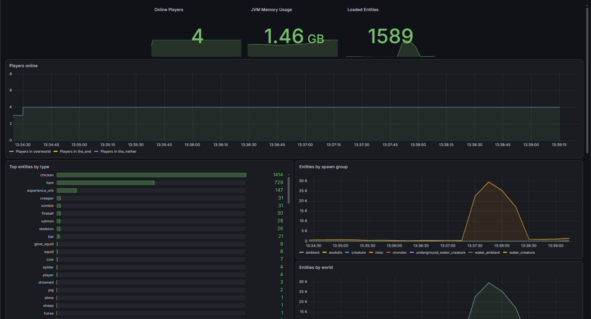

# Minecraft Server Monitoring Stack

Prometheus + Grafana monitoring stack for a minecraft fabric core, running fully containerized with docker compose.

## Stack
- **Prometheus** - scrapes JVM and Minecraft-specific metrics (players online, loaded entities/chunks, heap usage) from a fabric prometheus exporter mod
- **Grafana** - visualizes the metrics in a live dashboard

## Setup
1. Update `prometheus/prometheus.yml` with your server's exporter IP and port
2. Run `docker compose up -d`
3. Prometheus: `http://localhost:9090`
4. Grafana: `http://localhost:3000` (default login `admin`/`admin`)
5. Add Prometheus as a Grafana data source (`http://prometheus:9090`), then import or build a dashboard

## Showcase
You can visit https://snapshots.raintank.io/dashboard/snapshot/ZUXFXmcs2C4aYsIK9cHNaii9K8PPhMWc
or just check out the screenshot

